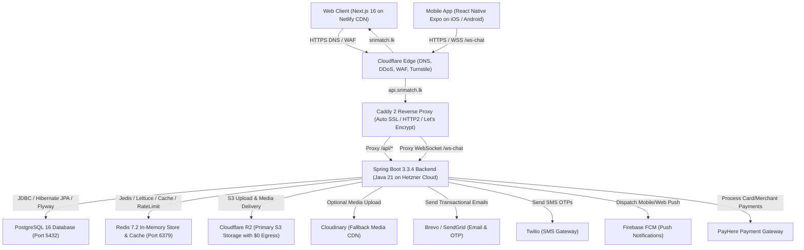

# SriMatch — Complete System, Architecture & Database Specification

> **Target Version**: SriMatch v1.0.0-SNAPSHOT  
> **Backend Framework**: Spring Boot 3.3.4 (Java 21 LTS)  
> **Frontend Framework**: React 19 + Vite 7 + TailwindCSS 4  
> **Primary Database**: MySQL 8.0 (with Migration Guide for PostgreSQL 16+)  
> **In-Memory Cache & Messaging**: Redis 7.2 + STOMP over WebSocket  

---

## Table of Contents
1. [Executive System Overview](#1-executive-system-overview)
2. [End-to-End System Architecture](#2-end-to-end-system-architecture)
3. [Core Subsystems & Business Workflows](#3-core-subsystems--business-workflows)
   - 3.1. Authentication & Security (Stateless JWT, CSRF, TOTP 2FA, Remember-Me)
   - 3.2. Profile Management & Multi-Stage Completion Engine
   - 3.3. Multi-Layer Matching & Compatibility Engine
   - 3.4. Likes, Star Likes & 5-Day Quota Cycle
   - 3.5. Real-Time Chat & STOMP WebSocket Messaging
   - 3.6. Subscriptions, Payments & Profile Boosting Lifecycle
   - 3.7. User Identity Verification & Admin Audit Subsystem
   - 3.8. External Integrations (Cloudinary, Brevo, Twilio, Firebase)
4. [Frontend Architecture & State Management](#4-frontend-architecture--state-management)
5. [In-Depth Database Structure & Schema Reference](#5-in-depth-database-structure--schema-reference)
   - 5.1. Comprehensive Table Inventory (All 22 Tables)
   - 5.2. Detailed Schema Definitions & Constraints
   - 5.3. Enums Dictionary (32 Enums)
   - 5.4. JPA Entity to Database Mappings & Converters
6. [PostgreSQL Migration Guide & Action Plan](#6-postgresql-migration-guide--action-plan)

---

# 1. Executive System Overview

**SriMatch** is an enterprise-grade matrimonial and matchmaking web application specifically tailored for Sri Lankan and South Asian cultural contexts. It bridges traditional cultural considerations (family background, cultural values, dietary habits) with modern dating features (instant messaging, photo privacy, identity verification, star likes, profile boosting).

### Core Highlights
- **High-Trust Identity Verification**: Mandatory OTP phone & email verification, government ID card scanning, and live selfie verification sessions.
- **Deep Cultural Compatibility Engine**: An 8-dimension weighted matching algorithm (Cultural, Lifestyle, Education, Location, Interests, Demographics, Family, Quiz) combined with dynamic activity & completion boosting.
- **Real-Time Communication**: Bidirectional STOMP WebSocket chat with delivery receipts, typing indicators, image sharing, and read acknowledgments.
- **Monetization Engine**: Tiered subscriptions, bank-transfer receipt uploads with admin manual approval, PayHere gateway integration, and micro-transaction profile boosts.
- **Administrative Control & 2FA**: Admin dashboard with TOTP Google Authenticator two-factor authentication, granular role permissions (`USER`, `ADMIN`, `SUPER_ADMIN`), and non-repudiation audit logging.

---

# 2. End-to-End System Architecture



---

# 3. Core Subsystems & Business Workflows

### 3.1. Authentication & Security
- **Stateless JWT Tokens**:
  - `Access Token`: 15-minute validity (stored in memory/state or HttpOnly cookie).
  - `Refresh Token`: 7-day validity (30-day for Remember-Me), stored in `refresh_tokens` table with client IP and User-Agent tracking for rotation.
- **CSRF & Header Shielding**:
  - `CsrfHeaderFilter` enforces strict anti-forgery headers on state-mutating requests (`POST`, `PUT`, `DELETE`, `PATCH`).
- **Brute-Force Lockout**:
  - Failed logins increment `failed_login_attempts`. 5 consecutive failed attempts trigger an automated account lockout (`account_locked_until = NOW() + 30 minutes`).
- **Admin 2FA (TOTP)**:
  - Admin login requires Google Authenticator 6-digit TOTP verification (`TotpService`) before granting access to `/api/v1/admin/*`.

---

### 3.2. Profile Management & Multi-Stage Completion Engine
A profile contains over 50 structured attributes:
1. **Basic Demographics**: Gender, Date & Time of Birth, Place of Birth, Lat/Lng coordinates, Marital Status, Children count.
2. **Cultural & Religion**: Religion, Practices, Ethnicity, Caste/Cultural values, Cultural & Family Values.
3. **Education & Career**: Degree level, Field of Study, Profession, Industry, Employer, Work Location, Income bracket.
4. **Physical & Lifestyle**: Height (cm), Body Type, Complexion, Smoking, Drinking, Diet, Health habits.
5. **Family Background**: Family Type (Nuclear/Joint), Family Involvement, Wedding preferences.
6. **Partner Preferences & Dealbreakers**: JSON-serialized preferences for age, height, education, religion, and location.
7. **Score Engine (`completion_score`)**:
   - Calculates a 0–100% score based on filled fields, directly boosting visibility in discovery feeds.

---

### 3.3. Multi-Layer Matching & Compatibility Engine
The `MatchingService` calculates a composite compatibility percentage:
$$\text{Score} = \left( \sum_{i=1}^{8} W_i \times S_i \right) \times M_{\text{boost}}$$

| Dimension ($i$) | Weight ($W_i$) | Matching Criteria & Logic |
|---|---|---|
| **Cultural** | 25% | Same religion (+60), matching religious practices (+20), matching ethnicity (+10), astrological element harmony (+10). |
| **Lifestyle** | 20% | Baseline 70. Penalizes smoking divergence (-20) and drinking divergence (-20); rewards matching dietary preference (+30). |
| **Education** | 15% | Baseline 50. Matching education tier (+30), same professional industry (+20). |
| **Location** | 10% | Same district (+100); willingness to relocate anywhere (+70); different district (+30). |
| **Interests** | 10% | Jaccard similarity coefficient on interest tag sets: $\frac{|A \cap B|}{|A \cup B|} \times 100$. |
| **Demographics** | 10% | Penalizes age gaps $>5$ years (-20) or $>10$ years (-50); assesses height compatibility. |
| **Family** | 5% | Matching Family Type (Nuclear vs Joint) (+100 vs +50). |
| **Quiz Answers** | 5% | Percentage of identical answers in value/personality questionnaires. |

**Dynamic Boost Multiplier ($M_{\text{boost}}$)**:
- Activity within 24 hours: $+0.5$
- Activity within 72 hours: $+0.3$
- Profile Completion Score: $+\left(\frac{\text{score}}{100}\right) \times 0.3$
- Government ID Verified: $+0.2$
- Paid Profile Boost Active: $+1.0$
- Inactive $>30$ days: $-0.5$

---

### 3.4. Likes, Star Likes & 5-Day Quota Cycle
- **Quota Cycle**: Free users receive 15 Likes every 5 days (`like_limit=15`, `likes_used`, `last_like_reset`).
- **Star Like**: Priority expressions of interest highlighted to the recipient.
- **Mutual Match Auto-Trigger**:
  - When User B likes User A after User A already liked User B, the system marks the like `ACCEPTED`, creates an active `Match` record, sets calculated compatibility, and dispatches real-time WebSocket notifications to both users.

---

### 3.5. Real-Time Chat & STOMP WebSocket Messaging
- **Endpoint**: `/api/ws-chat` (SockJS fallback enabled).
- **Security**: `WebSocketAuthInterceptor` extracts and verifies JWT bearer token from STOMP connect headers.
- **Message Pipeline**:
  - Client publishes to `/app/chat.send`.
  - Stored in MySQL `messages` table with status `SENT`.
  - Dispatched to recipient via private queue `/user/{email}/queue/messages`.
  - Read receipts (`is_read`, `read_at`) broadcast back to sender via `/user/{email}/queue/message-status`.
- **Presence Tracking**: `RedisUserStatusService` tracks heartbeat pings and publishes online/offline statuses.

---

### 3.6. Subscriptions, Payments & Profile Boosting Lifecycle
- **Premium Packages**: Duration (e.g. 1, 3, 6, 12 months), unlimited likes, chat access, and view unmasked liker profiles.
- **Bank Transfer Verification Flow**:
  1. User selects `PremiumPackage` $\rightarrow$ creates `Subscription` in `PENDING` state.
  2. User uploads payment receipt image $\rightarrow$ creates `Payment` in `PENDING` state.
  3. Admin reviews slip in admin console $\rightarrow$ `PaymentReviewRequest` (Approve/Reject).
  4. If approved: `Subscription` marked `ACTIVE`, `users.is_premium = 1`, `users.premium_expiry_date = NOW() + package.timelineMonths`.
- **Profile Boost System**:
  - Users buy boost packs (1, 5, 10 boosts).
  - Activating a boost sets `profiles.is_boosted = true` and `profiles.boost_expires_at = NOW() + 1 hour`.
  - `BoostScheduler` runs every 5 minutes to deactivate expired boosts.

---

### 3.7. User Identity Verification & Admin Audit Subsystem
- **Verification Pipeline (`user_verifications`)**:
  - Supports `NIC`, `PASSPORT`, `DRIVING_LICENSE`, `SELFIE`.
  - Front image, back image, and selfie session token.
  - Admin reviews and marks `APPROVED` or `REJECTED`.
- **Audit Logging (`audit_logs`)**:
  - AOP and `AdminAuditInterceptor` intercept all administrative actions (`LOCK_USER`, `APPROVE_PAYMENT`, `CHANGE_PACKAGE`, `DELETE_PROFILE`), logging IP address, User-Agent, before/after JSON states, HTTP response status, and duration.

---

# 4. Frontend Architecture & State Management

The frontend is constructed using modern React 19 paradigms:

```
srimatch-frontend/src/
├── components/          # Reusable UI widgets & layouts
│   ├── admin/           # Admin data tables, metrics cards, review dialogs
│   ├── chat/            # ChatPane, ConversationList, MessageBubble
│   ├── home/            # FilterSidebar, ProfileCard, SearchHeader
│   ├── AdminLayout.jsx  # Admin sidebar & header layout
│   ├── Navbar.jsx       # Public & User responsive navigation
│   └── ProtectedRoute.jsx # Client-side JWT & role route guard
├── context/             # AuthContext provider
├── hooks/               # Custom React hooks (useLikes, useProfiles, useSubscription, useNotifications)
├── pages/               # 34 Full Route Pages
│   ├── Admin/           # Admin Users, Verifications, Payments, Packages, Audits, Settings
│   ├── HomePage.jsx     # Discover feed & advanced matching search
│   ├── MessagesPage.jsx # Real-time chat workspace
│   ├── MyProfilePage.jsx# Full profile editor (5-step wizard)
│   └── SubscriptionPage.jsx # Upgrade & receipt upload flow
├── services/            # Axios API clients & WebSocket STOMP service
│   ├── base.service.js  # Global Axios instance with XSRF and 401 refresh interceptors
│   └── websocket.service.js # STOMP over SockJS singleton client
└── store/               # Zustand global state stores (useAuthStore, useProfileStore)
```

---

# 5. In-Depth Database Structure & Schema Reference

### 5.1. Comprehensive Table Inventory (All 22 Tables)

| # | Table Name | Purpose / Responsibility |
|---|---|---|
| 1 | `users` | Core user credentials, roles, verification flags, security lockouts, and like counters. |
| 2 | `profiles` | 50+ matrimonial profile fields, lifestyle, family, and partner preferences. |
| 3 | `refresh_tokens` | Persisted JWT refresh tokens for session rotation and Remember-Me persistence. |
| 4 | `otp_verifications` | OTP codes for SMS/Email validation with expiration and attempt limiting. |
| 5 | `likes` | Normal and Star likes between users with status tracking (`PENDING`, `ACCEPTED`, `REJECTED`). |
| 6 | `matches` | Mutual matches with computed compatibility scores and expiration states. |
| 7 | `messages` | Chat messages with delivery/read tracking, media attachments, and soft deletion. |
| 8 | `notifications` | In-app user alerts for likes, matches, messages, and admin updates. |
| 9 | `premium_packages` | Available subscription tiers with pricing, duration, and discounts. |
| 10 | `boost_packages` | Profile boost credit packages with pricing and boost counts. |
| 11 | `bank_details` | Company bank accounts displayed to users for offline payment transfers. |
| 12 | `subscriptions` | User subscription history and active subscription validity periods. |
| 13 | `payments` | Payment transaction records, receipt uploads, and admin review statuses. |
| 14 | `reports` | User reports for spam, inappropriate behavior, or fake profiles. |
| 15 | `audit_logs` | Audit trail of all administrative operations and mutations. |
| 16 | `profile_views` | Profile visit history for analytics and "who viewed my profile" feature. |
| 17 | `cities` | Master lookup table of Sri Lankan cities, districts, and postal codes. |
| 18 | `system_settings` | Dynamic key-value configuration flags (maintenance mode, free like limits). |
| 19 | `support_tickets` | Customer support ticket threads submitted by users. |
| 20 | `support_ticket_messages` | Threaded customer support correspondence between users and admins. |
| 21 | `jwt_blacklist` | Invalidated / logged-out JWT tokens. |
| 22 | `user_verifications` | Government ID and selfie verification documents and review workflow. |

---

### 5.2. Detailed Schema Definitions & Constraints

```sql
-- 1. USERS
CREATE TABLE users (
    id BIGINT AUTO_INCREMENT PRIMARY KEY,
    first_name VARCHAR(50) NOT NULL,
    last_name VARCHAR(50) NOT NULL,
    email VARCHAR(100) NOT NULL UNIQUE,
    phone_number VARCHAR(20) UNIQUE,
    password VARCHAR(255) NOT NULL,
    role VARCHAR(20) NOT NULL DEFAULT 'USER',
    is_email_verified BIT(1) DEFAULT 0,
    is_phone_verified BIT(1) DEFAULT 0,
    is_profile_completed BIT(1) DEFAULT 0,
    is_premium BIT(1) DEFAULT 0,
    premium_expiry_date DATETIME(6),
    referral_code_used VARCHAR(255),
    agree_to_marketing BIT(1) DEFAULT 0,
    agree_to_terms BIT(1) DEFAULT 0,
    last_login_at DATETIME(6),
    failed_login_attempts INT DEFAULT 0,
    account_locked_until DATETIME(6),
    is_deleted BIT(1) DEFAULT 0,
    deleted_at DATETIME(6),
    password_changed_at DATETIME(6),
    like_limit INT NOT NULL DEFAULT 15,
    likes_used INT NOT NULL DEFAULT 0,
    last_like_reset DATETIME(6),
    boost_count INT DEFAULT 0,
    last_boost_renew_at DATETIME(6),
    is_online BOOLEAN DEFAULT FALSE,
    last_seen_at DATETIME,
    fcm_token VARCHAR(255),
    oauth_provider VARCHAR(20),
    oauth_provider_id VARCHAR(255),
    totp_secret VARCHAR(64),
    totp_enabled BOOLEAN NOT NULL DEFAULT FALSE,
    created_at DATETIME(6) NOT NULL,
    updated_at DATETIME(6),
    INDEX idx_email (email),
    INDEX idx_phone (phone_number),
    INDEX idx_role (role),
    INDEX idx_created_at (created_at),
    INDEX idx_user_online (is_online),
    INDEX idx_user_last_seen (last_seen_at),
    INDEX idx_user_fcm_token (fcm_token)
);

-- 2. PROFILES
CREATE TABLE profiles (
    id BIGINT AUTO_INCREMENT PRIMARY KEY,
    user_id BIGINT NOT NULL UNIQUE,
    gender VARCHAR(20),
    date_of_birth DATE,
    time_of_birth TIME,
    marital_status VARCHAR(20),
    has_children BIT(1),
    number_of_children INT,
    district VARCHAR(100),
    city VARCHAR(100),
    place_of_birth VARCHAR(100),
    latitude DOUBLE,
    longitude DOUBLE,
    religion VARCHAR(20),
    religious_practices TEXT,
    ethnicity VARCHAR(20),
    languages LONGTEXT,                -- JSON array string
    birth_star VARCHAR(50),
    education VARCHAR(30),
    field_of_study VARCHAR(100),
    profession VARCHAR(100),
    industry VARCHAR(100),
    employer VARCHAR(200),
    work_location VARCHAR(100),
    income_range VARCHAR(50),
    relocation_willingness VARCHAR(30) DEFAULT 'NOT_WILLING',
    height INT,
    body_type VARCHAR(20),
    complexion VARCHAR(20),
    smoking VARCHAR(20),
    drinking VARCHAR(20),
    dietary_preferences VARCHAR(30),
    health_habits TEXT,
    lifestyle TEXT,
    family_background TEXT,
    cultural_values TEXT,
    family_involvement TEXT,
    wedding_preferences TEXT,
    family_type VARCHAR(20) DEFAULT 'NUCLEAR',
    about TEXT,
    interests LONGTEXT,                -- JSON array string
    favorite_things LONGTEXT,          -- JSON object string
    travel_preferences TEXT,
    personality_traits VARCHAR(500),
    partner_preferences LONGTEXT,      -- JSON object string
    dealbreakers TEXT,
    profile_images LONGTEXT,           -- JSON array string
    primary_image_url VARCHAR(500),
    quiz_answers LONGTEXT,             -- JSON object string
    verification_status LONGTEXT,      -- JSON object string
    completion_score INT DEFAULT 0,
    is_boosted BOOLEAN DEFAULT FALSE,
    boost_expires_at DATETIME(6),
    id_verified BOOLEAN DEFAULT FALSE,
    profile_views INT DEFAULT 0,
    last_active_at DATETIME(6),
    is_visible BIT(1) DEFAULT 1,
    is_deleted BIT(1) DEFAULT 0,
    deleted_at DATETIME(6),
    created_at DATETIME(6) NOT NULL,
    updated_at DATETIME(6),
    CONSTRAINT fk_profile_user FOREIGN KEY (user_id) REFERENCES users (id) ON DELETE CASCADE,
    INDEX idx_gender (gender),
    INDEX idx_religion (religion),
    INDEX idx_district (district),
    INDEX idx_marital_status (marital_status),
    INDEX idx_completion_score (completion_score),
    INDEX idx_last_active (last_active_at),
    INDEX idx_birth_coordinates (latitude, longitude)
);

-- 3. REFRESH_TOKENS
CREATE TABLE refresh_tokens (
    id BIGINT AUTO_INCREMENT PRIMARY KEY,
    token VARCHAR(500) NOT NULL UNIQUE,
    user_id BIGINT NOT NULL,
    expires_at DATETIME(6) NOT NULL,
    created_at DATETIME(6) NOT NULL,
    revoked BIT(1) DEFAULT 0,
    used BIT(1) DEFAULT 0,
    used_at DATETIME(6),
    user_agent VARCHAR(255),
    ip_address VARCHAR(45),
    remember_me BIT(1) DEFAULT 0,
    CONSTRAINT fk_token_user FOREIGN KEY (user_id) REFERENCES users (id) ON DELETE CASCADE,
    INDEX idx_token (token),
    INDEX idx_user_id (user_id),
    INDEX idx_expires_at (expires_at)
);

-- 4. OTP_VERIFICATIONS
CREATE TABLE otp_verifications (
    id BIGINT AUTO_INCREMENT PRIMARY KEY,
    identifier VARCHAR(100) NOT NULL,
    otp VARCHAR(6) NOT NULL,
    otp_type VARCHAR(20) NOT NULL,
    is_verified BIT(1) DEFAULT 0,
    expires_at DATETIME(6) NOT NULL,
    attempts INT DEFAULT 0,
    created_at DATETIME(6) NOT NULL,
    INDEX idx_identifier_type (identifier, otp_type),
    INDEX idx_expires_at (expires_at)
);

-- 5. LIKES
CREATE TABLE likes (
    id BIGINT AUTO_INCREMENT PRIMARY KEY,
    sender_id BIGINT NOT NULL,
    receiver_id BIGINT NOT NULL,
    status VARCHAR(20) NOT NULL DEFAULT 'PENDING',
    type VARCHAR(20) NOT NULL DEFAULT 'NORMAL',
    message TEXT,
    expires_at DATETIME(6),
    responded_at DATETIME(6),
    created_at DATETIME(6) NOT NULL,
    updated_at DATETIME(6),
    UNIQUE (sender_id, receiver_id),
    CONSTRAINT fk_like_sender FOREIGN KEY (sender_id) REFERENCES users (id) ON DELETE CASCADE,
    CONSTRAINT fk_like_receiver FOREIGN KEY (receiver_id) REFERENCES users (id) ON DELETE CASCADE,
    INDEX idx_sender_id (sender_id),
    INDEX idx_receiver_id (receiver_id),
    INDEX idx_status (status),
    INDEX idx_type (type),
    INDEX idx_created_at (created_at)
);

-- 6. MATCHES
CREATE TABLE matches (
    id BIGINT AUTO_INCREMENT PRIMARY KEY,
    user1_id BIGINT NOT NULL,
    user2_id BIGINT NOT NULL,
    like_id BIGINT,
    status VARCHAR(20) NOT NULL DEFAULT 'ACTIVE',
    compatibility_score INT DEFAULT 0,
    user1_notified BIT(1) DEFAULT 0,
    user2_notified BIT(1) DEFAULT 0,
    matched_at DATETIME(6),
    expires_at DATETIME(6),
    ended_at DATETIME(6),
    end_reason VARCHAR(100),
    created_at DATETIME(6) NOT NULL,
    updated_at DATETIME(6),
    CONSTRAINT fk_match_user1 FOREIGN KEY (user1_id) REFERENCES users (id) ON DELETE CASCADE,
    CONSTRAINT fk_match_user2 FOREIGN KEY (user2_id) REFERENCES users (id) ON DELETE CASCADE,
    INDEX idx_user1_id (user1_id),
    INDEX idx_user2_id (user2_id),
    INDEX idx_status (status),
    INDEX idx_created_at (created_at),
    INDEX idx_compatibility_score (compatibility_score)
);

-- 7. MESSAGES
CREATE TABLE messages (
    id BIGINT AUTO_INCREMENT PRIMARY KEY,
    match_id BIGINT,
    sender_id BIGINT NOT NULL,
    receiver_id BIGINT NOT NULL,
    content TEXT NOT NULL,
    type VARCHAR(20) NOT NULL DEFAULT 'TEXT',
    status VARCHAR(20) NOT NULL DEFAULT 'SENT',
    is_read BIT(1) DEFAULT 0,
    read_at DATETIME(6),
    is_premium_message BIT(1) DEFAULT 0,
    is_delivered BIT(1) DEFAULT 0,
    delivered_at DATETIME(6),
    is_deleted_by_sender BIT(1) DEFAULT 0,
    is_deleted_by_receiver BIT(1) DEFAULT 0,
    media_url VARCHAR(500),
    media_type VARCHAR(50),
    media_size BIGINT,
    created_at DATETIME(6) NOT NULL,
    updated_at DATETIME(6),
    CONSTRAINT fk_message_match FOREIGN KEY (match_id) REFERENCES matches (id) ON DELETE SET NULL,
    CONSTRAINT fk_message_sender FOREIGN KEY (sender_id) REFERENCES users (id) ON DELETE CASCADE,
    CONSTRAINT fk_message_receiver FOREIGN KEY (receiver_id) REFERENCES users (id) ON DELETE CASCADE,
    INDEX idx_match_id (match_id),
    INDEX idx_sender_id (sender_id),
    INDEX idx_receiver_id (receiver_id),
    INDEX idx_status (status),
    INDEX idx_created_at (created_at)
);

-- 8. NOTIFICATIONS
CREATE TABLE notifications (
    id BIGINT AUTO_INCREMENT PRIMARY KEY,
    user_id BIGINT NOT NULL,
    title VARCHAR(255) NOT NULL,
    message TEXT NOT NULL,
    type VARCHAR(20) NOT NULL,
    related_entity_id BIGINT,
    related_entity_type VARCHAR(50),
    action_url VARCHAR(500),
    is_read BIT(1) DEFAULT 0,
    read_at DATETIME(6),
    is_sent BIT(1) DEFAULT 0,
    sent_at DATETIME(6),
    is_delivered BIT(1) DEFAULT 0,
    delivered_at DATETIME(6),
    icon VARCHAR(50),
    color VARCHAR(20),
    created_at DATETIME(6) NOT NULL,
    CONSTRAINT fk_notification_user FOREIGN KEY (user_id) REFERENCES users (id) ON DELETE CASCADE,
    INDEX idx_user_id (user_id),
    INDEX idx_is_read (is_read),
    INDEX idx_type (type),
    INDEX idx_created_at (created_at)
);

-- 9. PREMIUM_PACKAGES
CREATE TABLE premium_packages (
    id BIGINT AUTO_INCREMENT PRIMARY KEY,
    title VARCHAR(100) NOT NULL,
    description TEXT,
    price DECIMAL(10, 2) NOT NULL,
    timeline_months INT NOT NULL,
    offer_percentage INT DEFAULT 0,
    is_active BOOLEAN DEFAULT TRUE,
    created_at TIMESTAMP DEFAULT CURRENT_TIMESTAMP,
    updated_at TIMESTAMP DEFAULT CURRENT_TIMESTAMP ON UPDATE CURRENT_TIMESTAMP,
    INDEX idx_package_active (is_active)
);

-- 10. BOOST_PACKAGES
CREATE TABLE boost_packages (
    id BIGINT AUTO_INCREMENT PRIMARY KEY,
    name VARCHAR(100) NOT NULL,
    description TEXT,
    price DECIMAL(19, 2) NOT NULL,
    boost_count INT NOT NULL,
    is_active BIT(1) DEFAULT 1,
    created_at DATETIME(6) NOT NULL,
    updated_at DATETIME(6)
);

-- 11. BANK_DETAILS
CREATE TABLE bank_details (
    id BIGINT AUTO_INCREMENT PRIMARY KEY,
    bank_name VARCHAR(100) NOT NULL,
    branch_name VARCHAR(100) NOT NULL,
    account_number VARCHAR(50) NOT NULL,
    account_holder_name VARCHAR(100) NOT NULL,
    is_active BOOLEAN DEFAULT TRUE,
    created_at TIMESTAMP DEFAULT CURRENT_TIMESTAMP,
    updated_at TIMESTAMP DEFAULT CURRENT_TIMESTAMP ON UPDATE CURRENT_TIMESTAMP
);

-- 12. SUBSCRIPTIONS
CREATE TABLE subscriptions (
    id BIGINT AUTO_INCREMENT PRIMARY KEY,
    user_id BIGINT NOT NULL,
    package_id BIGINT NOT NULL,
    start_date DATETIME(6),
    end_date DATETIME(6),
    status VARCHAR(50) NOT NULL,
    created_at TIMESTAMP DEFAULT CURRENT_TIMESTAMP,
    updated_at TIMESTAMP DEFAULT CURRENT_TIMESTAMP ON UPDATE CURRENT_TIMESTAMP,
    CONSTRAINT fk_subscription_user FOREIGN KEY (user_id) REFERENCES users(id),
    CONSTRAINT fk_subscription_package FOREIGN KEY (package_id) REFERENCES premium_packages(id),
    INDEX idx_subscription_user (user_id),
    INDEX idx_subscription_status (status)
);

-- 13. PAYMENTS
CREATE TABLE payments (
    id BIGINT AUTO_INCREMENT PRIMARY KEY,
    user_id BIGINT NOT NULL,
    subscription_id BIGINT NULL,
    boost_package_id BIGINT NULL,
    payment_type VARCHAR(30) NOT NULL DEFAULT 'SUBSCRIPTION',
    amount DECIMAL(10, 2) NOT NULL,
    payment_method VARCHAR(50) NOT NULL,
    receipt_url VARCHAR(500),
    payment_status VARCHAR(50) NOT NULL,
    transaction_id VARCHAR(100),
    submitted_at TIMESTAMP DEFAULT CURRENT_TIMESTAMP,
    reviewed_at TIMESTAMP NULL,
    reviewed_by BIGINT,
    rejection_reason VARCHAR(255),
    CONSTRAINT fk_payment_user FOREIGN KEY (user_id) REFERENCES users(id),
    CONSTRAINT fk_payment_subscription FOREIGN KEY (subscription_id) REFERENCES subscriptions(id),
    CONSTRAINT fk_payment_boost_package FOREIGN KEY (boost_package_id) REFERENCES boost_packages(id) ON DELETE SET NULL,
    CONSTRAINT fk_payment_reviewer FOREIGN KEY (reviewed_by) REFERENCES users(id),
    INDEX idx_payment_status (payment_status)
);

-- 14. REPORTS
CREATE TABLE reports (
    id BIGINT AUTO_INCREMENT PRIMARY KEY,
    reporter_id BIGINT NOT NULL,
    reported_user_id BIGINT NOT NULL,
    reason VARCHAR(50) NOT NULL,
    description TEXT NOT NULL,
    evidence_urls TEXT,
    status VARCHAR(20) NOT NULL DEFAULT 'PENDING',
    admin_notes TEXT,
    resolved_at DATETIME(6),
    resolved_by BIGINT,
    action_taken VARCHAR(255),
    created_at DATETIME(6) NOT NULL,
    updated_at DATETIME(6),
    CONSTRAINT fk_report_reporter FOREIGN KEY (reporter_id) REFERENCES users (id) ON DELETE CASCADE,
    CONSTRAINT fk_report_reported_user FOREIGN KEY (reported_user_id) REFERENCES users (id) ON DELETE CASCADE,
    CONSTRAINT fk_report_resolver FOREIGN KEY (resolved_by) REFERENCES users (id) ON DELETE SET NULL,
    INDEX idx_reporter_id (reporter_id),
    INDEX idx_reported_user_id (reported_user_id),
    INDEX idx_status (status),
    INDEX idx_created_at (created_at)
);

-- 15. AUDIT_LOGS
CREATE TABLE audit_logs (
    id BIGINT AUTO_INCREMENT PRIMARY KEY,
    user_id BIGINT,
    user_email VARCHAR(100),
    action VARCHAR(100) NOT NULL,
    entity_type VARCHAR(50),
    entity_id BIGINT,
    details TEXT,
    old_value TEXT,
    new_value TEXT,
    ip_address VARCHAR(45),
    user_agent VARCHAR(500),
    request_method VARCHAR(10),
    request_url VARCHAR(500),
    status_code INT,
    response_time_ms BIGINT,
    success BOOLEAN NOT NULL DEFAULT TRUE,
    created_at TIMESTAMP DEFAULT CURRENT_TIMESTAMP,
    INDEX idx_audit_user_id (user_id),
    INDEX idx_audit_email (user_email),
    INDEX idx_audit_action (action),
    INDEX idx_audit_created_at (created_at)
);

-- 16. PROFILE_VIEWS
CREATE TABLE profile_views (
    id BIGINT AUTO_INCREMENT PRIMARY KEY,
    viewer_id BIGINT NOT NULL,
    viewed_profile_id BIGINT NOT NULL,
    viewed_at TIMESTAMP DEFAULT CURRENT_TIMESTAMP,
    CONSTRAINT fk_viewer FOREIGN KEY (viewer_id) REFERENCES users(id),
    CONSTRAINT fk_viewed_profile FOREIGN KEY (viewed_profile_id) REFERENCES profiles(id),
    INDEX idx_viewer_profile (viewer_id, viewed_profile_id),
    INDEX idx_viewed_at (viewed_at)
);

-- 17. CITIES
CREATE TABLE cities (
    id BIGINT AUTO_INCREMENT PRIMARY KEY,
    district_id INT,
    name_en VARCHAR(255),
    name_si VARCHAR(255),
    name_ta VARCHAR(255),
    sub_name_en VARCHAR(255),
    sub_name_si VARCHAR(255),
    sub_name_ta VARCHAR(255),
    postcode VARCHAR(255),
    latitude DOUBLE,
    longitude DOUBLE
);

-- 18. SYSTEM_SETTINGS
CREATE TABLE system_settings (
    setting_key VARCHAR(100) NOT NULL PRIMARY KEY,
    setting_value TEXT,
    description VARCHAR(255),
    setting_group VARCHAR(50),
    data_type VARCHAR(50),
    created_at TIMESTAMP DEFAULT CURRENT_TIMESTAMP,
    updated_at TIMESTAMP DEFAULT CURRENT_TIMESTAMP ON UPDATE CURRENT_TIMESTAMP
);

-- 19. SUPPORT_TICKETS
CREATE TABLE support_tickets (
    id BIGINT AUTO_INCREMENT PRIMARY KEY,
    user_id BIGINT NOT NULL,
    subject VARCHAR(255) NOT NULL,
    status VARCHAR(20) NOT NULL,
    priority VARCHAR(20) NOT NULL,
    created_at TIMESTAMP DEFAULT CURRENT_TIMESTAMP,
    updated_at TIMESTAMP DEFAULT CURRENT_TIMESTAMP ON UPDATE CURRENT_TIMESTAMP,
    FOREIGN KEY (user_id) REFERENCES users(id) ON DELETE CASCADE
);

-- 20. SUPPORT_TICKET_MESSAGES
CREATE TABLE support_ticket_messages (
    id BIGINT AUTO_INCREMENT PRIMARY KEY,
    ticket_id BIGINT NOT NULL,
    sender_id BIGINT NOT NULL,
    is_admin_reply BOOLEAN NOT NULL DEFAULT FALSE,
    message TEXT NOT NULL,
    created_at TIMESTAMP DEFAULT CURRENT_TIMESTAMP,
    FOREIGN KEY (ticket_id) REFERENCES support_tickets(id) ON DELETE CASCADE,
    FOREIGN KEY (sender_id) REFERENCES users(id) ON DELETE CASCADE
);

-- 21. JWT_BLACKLIST
CREATE TABLE jwt_blacklist (
    id BIGINT AUTO_INCREMENT PRIMARY KEY,
    token TEXT NOT NULL,
    user_email VARCHAR(100),
    expires_at DATETIME NOT NULL,
    created_at TIMESTAMP DEFAULT CURRENT_TIMESTAMP,
    INDEX idx_jwt_expiry (expires_at)
);

-- 22. USER_VERIFICATIONS
CREATE TABLE user_verifications (
    id BIGINT AUTO_INCREMENT PRIMARY KEY,
    user_id BIGINT NOT NULL,
    type VARCHAR(30) NOT NULL,
    status VARCHAR(30) NOT NULL,
    id_front_path VARCHAR(255),
    id_back_path VARCHAR(255),
    selfie_path VARCHAR(255),
    selfie_session_token VARCHAR(100),
    admin_notes TEXT,
    resolved_at DATETIME,
    resolved_by BIGINT,
    created_at TIMESTAMP DEFAULT CURRENT_TIMESTAMP,
    updated_at TIMESTAMP DEFAULT CURRENT_TIMESTAMP ON UPDATE CURRENT_TIMESTAMP,
    CONSTRAINT fk_verif_user FOREIGN KEY (user_id) REFERENCES users(id),
    CONSTRAINT fk_verif_admin FOREIGN KEY (resolved_by) REFERENCES users(id)
);
```

---

### 5.3. Enums Dictionary (32 Enums)

| Enum File | Values Defined |
|---|---|
| `UserRole` | `USER`, `ADMIN`, `SUPER_ADMIN` |
| `Gender` | `MALE`, `FEMALE`, `OTHER` |
| `MaritalStatus` | `NEVER_MARRIED`, `DIVORCED`, `WIDOWED`, `SEPARATED` |
| `Religion` | `BUDDHIST`, `HINDU`, `ISLAM`, `ROMAN_CATHOLIC`, `CHRISTIAN_NON_RC`, `OTHER` |
| `Ethnicity` | `SINHALESE`, `SRI_LANKAN_TAMIL`, `INDIAN_TAMIL`, `SRI_LANKAN_MOOR`, `BURGER`, `MALAY`, `OTHER` |
| `EducationLevel` | `ORDINARY_LEVEL`, `ADVANCED_LEVEL`, `DIPLOMA`, `BACHELORS`, `MASTERS`, `DOCTORATE`, `PROFESSIONAL` |
| `RelocationWillingness`| `NOT_WILLING`, `WITHIN_COUNTRY`, `ABROAD`, `ANYWHERE` |
| `FamilyType` | `NUCLEAR`, `JOINT` |
| `BodyType` | `SLIM`, `AVERAGE`, `ATHLETIC`, `HEAVY` |
| `Complexion` | `FAIR`, `VERY_FAIR`, `WHEATISH`, `DARK` |
| `SmokingHabit` | `NEVER`, `OCCASIONALLY`, `REGULARLY` |
| `DrinkingHabit` | `NEVER`, `SOCIALLY`, `REGULARLY` |
| `DietaryPreference` | `VEGETARIAN`, `NON_VEGETARIAN`, `VEGAN`, `HALAL`, `EGGETARIAN` |
| `LikeStatus` | `PENDING`, `ACCEPTED`, `REJECTED`, `EXPIRED` |
| `LikeType` | `NORMAL`, `STAR` |
| `MatchStatus` | `ACTIVE`, `UNMATCHED`, `BLOCKED`, `EXPIRED` |
| `MessageType` | `TEXT`, `IMAGE`, `AUDIO`, `FILE` |
| `MessageStatus` | `SENT`, `DELIVERED`, `READ`, `FAILED` |
| `NotificationType` | `LIKE_RECEIVED`, `MATCH_CREATED`, `MESSAGE_RECEIVED`, `PROFILE_VIEW`, `SYSTEM`, `SUBSCRIPTION_EXPIRING` |
| `OtpType` | `EMAIL_VERIFICATION`, `PHONE_VERIFICATION`, `PASSWORD_RESET` |
| `PaymentMethod` | `BANK_TRANSFER`, `CREDIT_CARD`, `DEBIT_CARD`, `PAYHERE` |
| `PaymentStatus` | `PENDING`, `APPROVED`, `REJECTED`, `REFUNDED` |
| `SubscriptionStatus` | `PENDING`, `ACTIVE`, `EXPIRED`, `CANCELLED` |
| `VerificationType` | `NIC`, `PASSPORT`, `DRIVING_LICENSE`, `SELFIE` |
| `VerificationStatus` | `PENDING`, `APPROVED`, `REJECTED` |
| `TicketStatus` | `OPEN`, `IN_PROGRESS`, `RESOLVED`, `CLOSED` |
| `TicketPriority` | `LOW`, `MEDIUM`, `HIGH`, `URGENT` |
| `ReportReason` | `INAPPROPRIATE_PHOTOS`, `HARASSMENT`, `FAKE_PROFILE`, `SPAM`, `SCAM`, `OTHER` |
| `ReportStatus` | `PENDING`, `REVIEWED`, `DISMISSED`, `ACTION_TAKEN` |

---

### 5.4. JPA Entity to Database Mappings & Converters

The Spring Boot backend uses standard JPA annotations with custom Jackson converters for JSON storage:
- **`JsonListConverter.java`**: Implements `AttributeConverter<List<String>, String>`. Used on `languages`, `interests`, `profileImages`. Serializes to JSON string and parses on read.
- **`JsonMapConverter.java`**: Implements `AttributeConverter<Map<String, Object>, String>`. Used on `favoriteThings`, `partnerPreferences`, `quizAnswers`, `verificationStatus`.

---

# 6. PostgreSQL Migration Guide & Action Plan

When migrating SriMatch from **MySQL 8.0** to **PostgreSQL 16+**, execute the following steps:

### 1. Dialect & Type Translation Matrix

| MySQL 8.0 Type / Construct | PostgreSQL 16+ Equivalent | Notes |
|---|---|---|
| `BIGINT AUTO_INCREMENT` | `BIGINT GENERATED ALWAYS AS IDENTITY` or `BIGSERIAL` | Standard SQL identity syntax. |
| `BIT(1)` / `TINYINT(1)` | `BOOLEAN` | Use native `TRUE`/`FALSE` instead of `0`/`1`. |
| `DATETIME(6)` / `TIMESTAMP` | `TIMESTAMPTZ` / `TIMESTAMP WITH TIME ZONE` | PostgreSQL preserves explicit UTC/time-zone offsets. |
| `LONGTEXT` / `TEXT` | `TEXT` or `JSONB` | For JSON columns (`languages`, `interests`, `partner_preferences`), PostgreSQL native `JSONB` provides high-speed indexing (`GIN`). |
| `DOUBLE` | `DOUBLE PRECISION` | Standard 64-bit IEEE floating point. |
| `VARCHAR(n)` | `VARCHAR(n)` | Identical. |
| `ON UPDATE CURRENT_TIMESTAMP` | PostgreSQL Trigger Function (`BEFORE UPDATE FOR EACH ROW`) | PostgreSQL requires a trigger to auto-update timestamp columns, or handled transparently by Hibernate `@UpdateTimestamp`. |

### 2. Required Dependency Changes (`pom.xml`)
Replace MySQL connector with PostgreSQL driver:
```xml
<!-- REMOVE -->
<!--
<dependency>
    <groupId>com.mysql</groupId>
    <artifactId>mysql-connector-j</artifactId>
    <scope>runtime</scope>
</dependency>
<dependency>
    <groupId>org.flywaydb</groupId>
    <artifactId>flyway-mysql</artifactId>
</dependency>
-->

<!-- ADD -->
<dependency>
    <groupId>org.postgresql</groupId>
    <artifactId>postgresql</artifactId>
    <scope>runtime</scope>
</dependency>
<dependency>
    <groupId>org.flywaydb</groupId>
    <artifactId>flyway-database-postgresql</artifactId>
</dependency>
```

### 3. Application Properties Adjustment
Update `application-prod.properties` and `application-dev.properties`:
```properties
spring.datasource.url=jdbc:postgresql://${DB_HOST:localhost}:${DB_PORT:5432}/${DB_NAME:srimatch_db}?sslmode=prefer
spring.datasource.username=${DB_USERNAME:srimatch_user}
spring.datasource.password=${DB_PASSWORD:srimatch_secret_pwd}
spring.datasource.driver-class-name=org.postgresql.Driver
spring.jpa.properties.hibernate.dialect=org.hibernate.dialect.PostgreSQLDialect
```

### 4. Docker Compose Adjustment
Update the database service definition in `docker-compose.yml`:
```yaml
  postgres:
    image: postgres:16-alpine
    container_name: srimatch-postgres
    restart: unless-stopped
    environment:
      POSTGRES_DB: ${DB_NAME:-srimatch_db}
      POSTGRES_USER: ${DB_USERNAME:-srimatch_user}
      POSTGRES_PASSWORD: ${DB_PASSWORD:-srimatch_secret_pwd}
      TZ: Asia/Colombo
    ports:
      - "${DB_PORT_FORWARD:-5432}:5432"
    volumes:
      - postgres_data:/var/lib/postgresql/data
    networks:
      - srimatch-network
    healthcheck:
      test: ["CMD-SHELL", "pg_isready -U ${DB_USERNAME:-srimatch_user} -d ${DB_NAME:-srimatch_db}"]
      interval: 10s
      timeout: 5s
      retries: 5

---

# 7. Production Cloud Infrastructure, CI/CD, & Object Storage Architecture

### 7.1. Infrastructure Topology (Hetzner + Cloudflare + Netlify)

| Subsystem | Technology | Hosting / Datacenter | Key Responsibilities |
|---|---|---|---|
| **DNS, WAF, & DDoS** | Cloudflare Free Tier | Global Edge (Colombo & Singapore POPs) | Instant DNS resolution, DDoS protection, Bot defense, Turnstile captcha. |
| **Web Frontend** | Next.js 16 (React 19) | Netlify Edge CDN (`srimatch.lk`) | SSR and static route delivery, global asset caching, security headers. |
| **Backend API Server** | Spring Boot 3.3.4 (Java 21) | Hetzner Cloud (Singapore `sin` datacenter) | REST controllers, authentication, matching engine, payment processing. |
| **Reverse Proxy & SSL** | Caddy 2 | Hetzner Cloud (`api.srimatch.lk`) | Automated Let's Encrypt SSL, HTTP/2, gzip/zstd, WebSocket proxying. |
| **Database** | PostgreSQL 16 Alpine | Hetzner Cloud (Attached NVMe Volume) | Relational storage, Flyway migrations, daily automated backup cron. |
| **Cache & Real-Time Presence** | Redis 7.2 Alpine | Hetzner Cloud | Session store, user online status, rate limiting, and temporary tokens. |
| **Object Storage (Media)** | Cloudflare R2 | S3-Compatible Storage (`media.srimatch.lk`) | Zero-egress fee media storage for profiles, chat, and payment receipts. |
| **Mobile Applications** | React Native (Expo SDK 57) | Google Play Store & Apple App Store | Native Android and iOS apps with on-device photo compression. |

---

### 7.2. Cloudflare R2 & Media Optimization Architecture

1. **Client-Side Image Pre-Compression**:
   - **Web App (`srimatch-web`)**: Uses native HTML5 Canvas API (`imageCompression.utils.ts`) to resize and compress photos into **WebP (1280x1600 max, 0.82 quality)** right in the browser, shrinking 5MB–15MB smartphone photos to **~80KB–150KB in under 50ms**.
   - **Mobile App (`srimatch-app`)**: Uses `expo-image-picker` with native on-device compression before upload.
2. **Backend S3 Object Storage (`R2StorageService.java`)**:
   - Built on AWS Java SDK v2 (`software.amazon.awssdk:s3`).
   - Automatically stores profile photos in `profiles/`, chat attachments in `chat/`, and payment slips in `receipts/`.
   - Generates clean custom URLs: `https://media.srimatch.lk/profiles/<uuid>.webp`.
   - Serves images with **$0 egress fees** and sub-10ms response times via Cloudflare Edge Caching.

---

### 7.3. Infrastructure as Code (Terraform) & Automated CI/CD

- **Terraform (`terraform/`)**: Automated provisioning of Hetzner Cloud server (`cpx21`), firewall (ports 22, 80, 443), 50GB NVMe persistent volume, and hardened cloud-init (Docker CE, UFW, Fail2ban, 4GB swap, and backup cron).
- **GitHub Actions Workflows (`.github/workflows/`)**:
  - `backend-ci-cd.yml`: Maven test $\rightarrow$ Docker build $\rightarrow$ GHCR push $\rightarrow$ Hetzner SSH rolling deployment with healthcheck verification.
  - `frontend-netlify.yml`: Next.js lint & build $\rightarrow$ Netlify preview & production deploy.
  - `mobile-release.yml`: Automated Expo EAS build and submission to Google Play Store and Apple App Store on release tags.
  - `terraform.yml`: Automated `terraform fmt -check`, validate, and plan.

---

### 7.4. Expiration & Maintenance Schedulers

| Scheduler Job | Frequency | Purpose |
|---|---|---|
| `expireBoosts()` | Every 1 minute | Reverts user `is_boosted` status and notifies user when profile boost expires. |
| `expireSubscriptions()` | Every 1 hour (`0 0 * * * *`) | Updates `is_premium` to false, marks `SubscriptionStatus.EXPIRED`, and dispatches notification. |
| `expireTikTokPromotions()` | Every 1 hour (`0 0 * * * *`) | Deactivates expired TikTok spotlight campaigns. |
| `backup.sh` | Daily at 02:00 AM (`/opt/srimatch/backup.sh`) | Runs `pg_dump` with gzip and enforces a 14-day rolling retention policy. |
