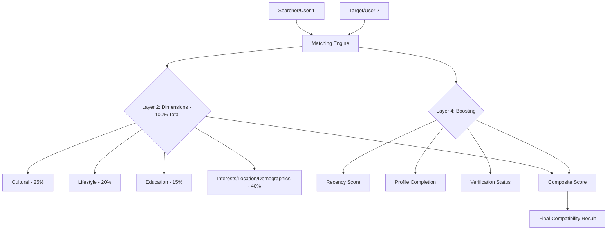

# SriMatch Backend - System Documentation

Welcome to the official documentation for the **SriMatch Backend**. This system is a high-performance, real-time matrimonial platform API built using modern Java/Spring architecture.

## 1. System Overview

SriMatch is designed to facilitate secure and efficient matchmaking. It manages the entire user lifecycle from registration and multi-factor verification to profile discovery, mutual matching, and real-time private communication.

### Core Philosophy
- **Identity First**: Strictly verified profiles via OTP and identity checks.
- **Deep Compatibility**: A data-driven matching engine that goes beyond basic filters.
- **Real-time Engagement**: Instant chat and notifications as core engagement drivers.

---

## 2. Technology Stack

The system is built on a cutting-edge, scalable stack:

- **Core Framework**: Spring Boot 3.3.4 (Java 21).
- **Security**: Stateless JWT Authentication with Spring Security.
- **Database**: MySQL (Compatible with v5.5+ using custom JSON converters).
- **Schema Management**: Flyway Migrations.
- **Real-time Messaging**: WebSocket with STOMP protocol.
- **Caching & Presence**: Redis (used for tracking online status and rate limiting).
- **Integrations**:
    - **Cloudinary**: Cloud-based media storage for profile images and chat attachments.
    - **Firebase (FCM)**: Cross-platform push notifications.
    - **Brevo (Sendinblue)**: Transactional emails (OTP, welcome, etc.).
    - **Bucket4j**: API Rate limiting for security and stability.

---

## 3. Key Business Logic & Modules

### A. The Matching Engine
The `MatchingService` uses a multi-layered scoring algorithm to calculate compatibility between two profiles.

### B. Mutual Matching & Likes
1. **Normal Like**: standard interest expression.
2. **Star Like**: Priority expression (often for premium users).
3. **Automated Match**: When two users like each other, the system automatically creates a `Match` entity and notifies both parties instantly via WebSocket and Push.

### C. Subscription & Payment Lifecycle
Users can upgrade to "Premium" to unlock unlimited likes and direct messaging features.
1. **Selection**: User picks a `PremiumPackage`.
2. **Initiation**: A `Subscription` is created in `PENDING` state.
3. **Payment**: User uploads a physical receipt/screenshot (`Payment` entity).
4. **Approval**: Admin reviews the receipt and approves, which triggers `SubscriptionService` to activate the status and calculate expiry.

---

## 4. REST API Endpoint Reference

All endpoints are prefixed with `/api/v1` unless otherwise specified.

### 🔐 Authentication (`/auth`)
| Method | Endpoint | Description |
| :--- | :--- | :--- |
| POST | `/register` | Register a new user account. |
| POST | `/login` | Authenticate and receive Access + Refresh JWTs. |
| POST | `/verify-email` | Verify email using OTP code. |
| POST | `/verify-phone` | Verify phone number using OTP. |
| POST | `/refresh-token` | Obtain new Access Token using Refresh Token. |
| POST | `/forgot-password` | Request password reset OTP. |
| POST | `/update-password` | Update password for authenticated user. |

### 👤 Profile Management (`/profile` & `/profiles`)
| Method | Endpoint | Description |
| :--- | :--- | :--- |
| GET | `/profile/me` | Fetch current user's profile details. |
| POST | `/profile` | Create or update full profile data. |
| POST | `/profile/image` | Upload profile image to Cloudinary. |
| GET | `/profiles` | Search/Discover public profiles based on filters. |
| GET | `/profiles/{id}` | View detailed public profile of another user. |

### ❤️ Likes & Matches (`/likes` & `/matches`)
| Method | Endpoint | Description |
| :--- | :--- | :--- |
| POST | `/likes/send` | Send a Normal or Star like to a user. |
| GET | `/likes/received` | List users who have liked you (masked for free users). |
| GET | `/matches` | List all active mutual matches. |

### 💬 Real-time Chat (`/chat`)
| Method | Endpoint | Description |
| :--- | :--- | :--- |
| POST | `/chat/send` | Send a message (also broadcasts via WebSocket). |
| GET | `/chat/history/{matchId}` | Fetch paginated chat history for a match. |
| POST | `/chat/media/upload` | Upload media (images/docs) for chat messages. |
| PATCH | `/chat/messages/{id}/read` | Mark a specific message as read. |

### 💰 Subscriptions & Payments (`/subscriptions` & `/payments`)
| Method | Endpoint | Description |
| :--- | :--- | :--- |
| GET | `/packages` | List all available premium packages. |
| POST | `/subscriptions/initiate/{id}` | Start a subscription process for a package. |
| GET | `/subscriptions/my/active` | Check current active premium status. |
| POST | `/payments/submit-receipt/{id}`| Submit proof of payment for approval. |
| GET | `/bank-details` | Fetch company bank details for manual transfers. |

### 🛡️ Admin Controls (`/admin/...`)
*Note: Requires ADMIN or SUPER_ADMIN role.*
| Method | Endpoint | Description |
| :--- | :--- | :--- |
| GET | `/admin/users` | List and manage all registered users. |
| PATCH | `/admin/payments/{id}/review` | Approve or reject a pending payment receipt. |
| POST | `/admin/packages` | Create new premium packages. |
| PATCH | `/admin/users/{email}/lock` | Lock/Unlock user accounts. |

---

## 5. WebSocket (Real-time) Documentation

**Connection Endpoint**: `ws://[host]:8080/api/ws-chat`

### Inbound (From Client)
- All client messages should follow the STOMP protocol.
- Initial connection requires a `Authorization: Bearer <JWT>` header in the STOMP connect frame.

### Outbound (To Client)
The system pushes updates to the following destinations (prefixed with `/user` for specific targeting):

- `/user/queue/messages`: Receives new real-time messages.
- `/user/queue/message-status`: Receives updates when a message is delivered or read.
- `/topic/notifications`: General announcements (system-wide).

---

## 6. Security Architecture

### Stateless Authentication
The system uses **JWT (JSON Web Tokens)**. Every request (except public ones like Login/Register) must include:
`Authorization: Bearer YOUR_TOKEN_HERE`

### CORS Policy
Currently configured to allow requests from:
- `http://localhost:3000` (React Frontend)
- `http://localhost:5173` (Vite/Next.js Development)

### Data Integrity
All sensitive data (password, etc.) is hashed using **BCrypt**. Database communication is secured via JPA/Hibernate with strict validation.

---

> [!IMPORTANT]
> **Environment Configuration**: Ensure that `firebase-service-account.json` is present in `src/main/resources/` for push notifications to function correctly, and Cloudinary environment variables are set.
